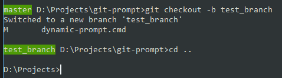

# Git Prompt
Windows command line prompt for Git.




1. [Problem](#problem)
2. [Solution](#solution)
3. [Installation](#installation)
4. [Modules](#modules)
    * [Dynamic prompt](#1-dynamic-prompt)
    * [Git wrapper](#2-git-wrapper)

---

## Problem
Goal is to have a GIT active branch name always in command prompt.

The problem is that it is not possible to use any variables when you set command line prompt e.g. the following command will set the time in the prompt but it won't be changing dynamically:

```
prompt %time% $P$G
```
Result:
```
9:40:07.23 D:\Projects>
9:40:07.23 D:\Projects>
9:40:07.23 D:\Projects>echo %time%
 9:40:26.88

9:40:07.23 D:\Projects>
```

When batch script line or command is executed it resolves all the variables first and executes the result. It means that the above command is equal to:
```
prompt 9:40:07.23 $P$G
```
Trying to escape % chars won't help here.

## Solution
Script which will be executing always on given command and setting the updated command prompt.

## Installation
To initialize Git Prompt use the following command:
```
git-wrapper.cmd /init
```
You can create a shortcut to cmd.exe and add this command in Target field on "Shortcut" properties tab e.g.:
```
cmd.exe /k "D:\Projects\git-wrapper.cmd /init"
```
## Modules
### 1. Dynamic prompt

Responsible for setting prompt based on given template. This file can be reused for any other purposes where you want to have a dynamic command prompt.

It uses template.txt file where you can define your custom command prompt e.g.
```
%time% %my_dynamic_var% $P$G
```

To initialize it you need to use /init switch with the command after which prompt should be updated. The following will be updating command prompt on every issued "git" command:
```
dynamic-prompt.cmd /init git
```
You can specify custom script (as a second param) which will run instead of the command given as first param. The following will setup dynamic-prompt to run on every "git" command and will execute git-wrapper.cmd instead of original "git" command (all the other arguments following the second one will be passed to the git-wrapper script)
```
dynamic-prompt.cmd /init git D:\Path\git-wrapper.cmd
```
### 2. Git wrapper
This script is responsible for two things:

1. Initialize the Git dynamic prompt
2. Update global variable which stores current branch name
